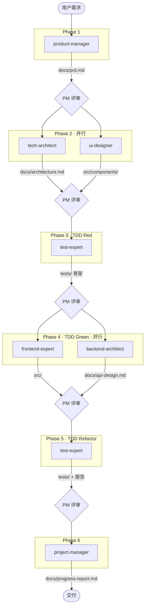

# Multi-Agent Schedule Demo

基于 Claude Code sub-agent 机制的多 Agent 协作调度系统。输入需求，自动按 TDD Pipeline 编排 7 个 Agent 完成项目开发。

## 架构

```
CLAUDE.md (调度入口)
  ├── pipeline/pipeline.yaml  (阶段定义 + 依赖)
  ├── pipeline/prompts.md     (各阶段 prompt 模板)
  └── .claude/agents/*.md     (7 个 Agent 定义)
```

## Pipeline



> `PM 评审` = project-manager agent 阶段评审，NEEDS_REVISION 时重新调度（最多 1 次）

## 快速开始

```bash
# 在 Claude Code 中打开项目
cd agent-schedule-demo
claude

# 输入需求，Pipeline 自动执行
> 帮我做一个 Todo App
```

## 自定义

- **换流程**: 修改 `pipeline/pipeline.yaml`
- **换 Agent**: 增删 `.claude/agents/*.md`，在 yaml 中引用
- **换项目**: 复制 `.claude/agents/` + `pipeline/` 到新项目
